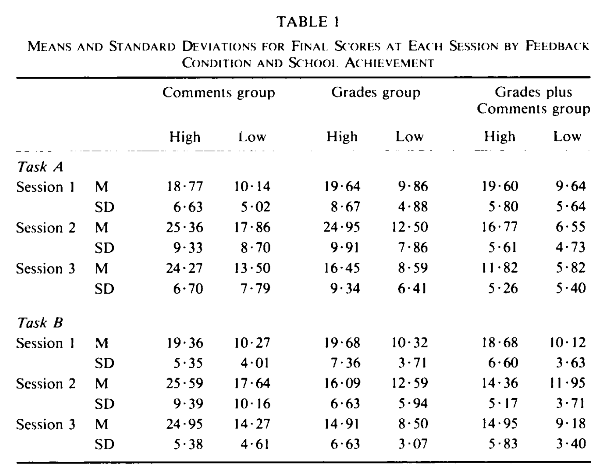
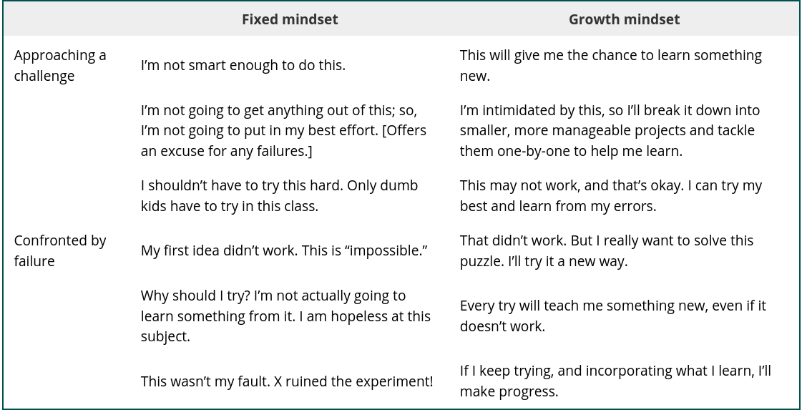
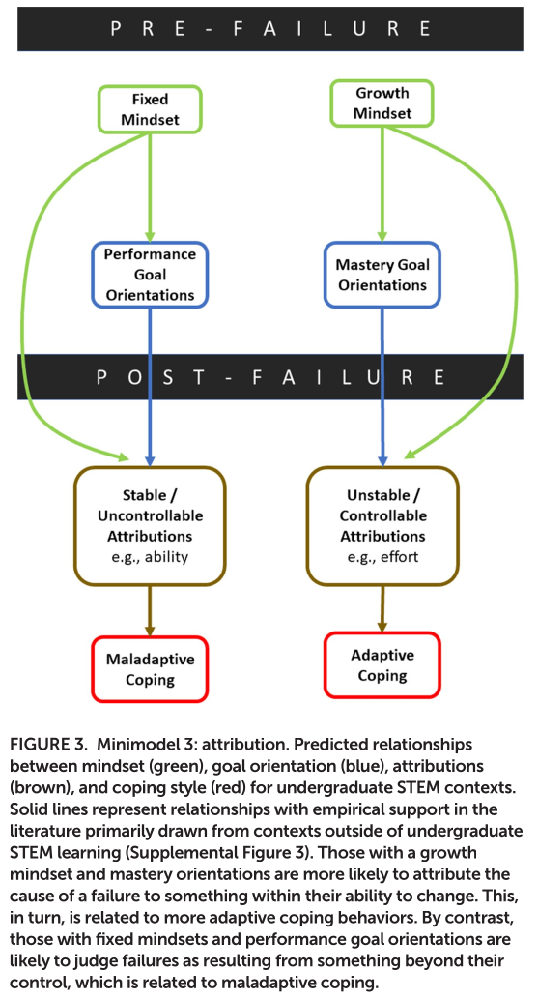

Ungrading
=====================================================================================

This course focuses on providing written feedback instead of assigning numerical scores to assignments.
`Research <https://raw.githubusercontent.com/jeremylt/csci-3656-fall-2025/refs/heads/main/source/downloads/Butler-EnhancingAndUnderminingIntrinsicMotivation-1988.pdf>`_ shows that scores undercut the effectiveness of written comments in the learning process.

During the course, you will keep a learning journal to keep a tab on progress toward your desired learning objectives.
You should reflect upon your performance and written feedback in your journal.
This journal and learning goals should be updated at least weekly, if not more often.

Some of the questions on quizzes and activities will be algorithmically scored or multiple choice.
This is intended to provide straightforward feedback on your progress rather than points to collect.

The goal of this course is to give you feedback to better inform your learning and help you adapt to meet your learning goals.
Failure is a natural part of the learning process, but `adaptive coping <https://raw.githubusercontent.com/jeremylt/csci-3656-fall-2025/refs/heads/main/source/downloads/HenryShorterCharkoudianHeemstraCorwin-FAILFrameworkChallengeResponsesSTEM-2019.pdf>`_ is needed to learn from failure.

.. note::
    Another perspective on this is to approach things with curiosity: What exactly did I do? Why did this not work? What exactly was I wanting to accomplish? These questions point you towards learning rather than just trying to achieve an objective.

At the end of the semester, we will meet to discuss your performance.
You will propose a final grade and we will discuss how your journal, goals, and feedback support this proposed grade.

* A - Excellent. Student is capable of independent learning with and extending the course material.

* B - Good. Student understands the core concepts and has extended this understanding in at least one area.

* C - Satisfactory. Student understands the core concepts and can use, with collaborators or research, the course concepts appropriately.

* D - Unsatisfactory. Student understands some of the core concepts but is missing key pieces.

This `video <https://www.youtube.com/watch?v=fe-SZ_FPZew>`_ explains many of the core ideas about ungrading.

Learning Journal Suggestion
---------------------------

The format of your journal is up to you to figure out. I will offer a suggestion.
Your journal could be split into two primary parts: semester goals and weekly reviews.
The semester goals are the overarching goals of what you're hoping to get out of the course. e.g.

* Understand what a "thread" is and how I might use them
* Ablility to evaluate my research group code's performance and hypothesize improvements of that performance
* Explain the difference between a CPU and GPU, and why I might use one vs the other

Then every week, a reflection could follow a three piece format covering

* Progress - What did I do/learn this week?
* Challenges - What issues/roadblocks did I run into this week? Do I have any confusions or more questions I want to be answered or addressed?
* Todos - What am I going to do this next week to pursue my semester goals or address roadblocks?

This weekly system is also quite good for industry and research too; it's how I format most of my weekly research update meetings with PIs and stakeholders.
